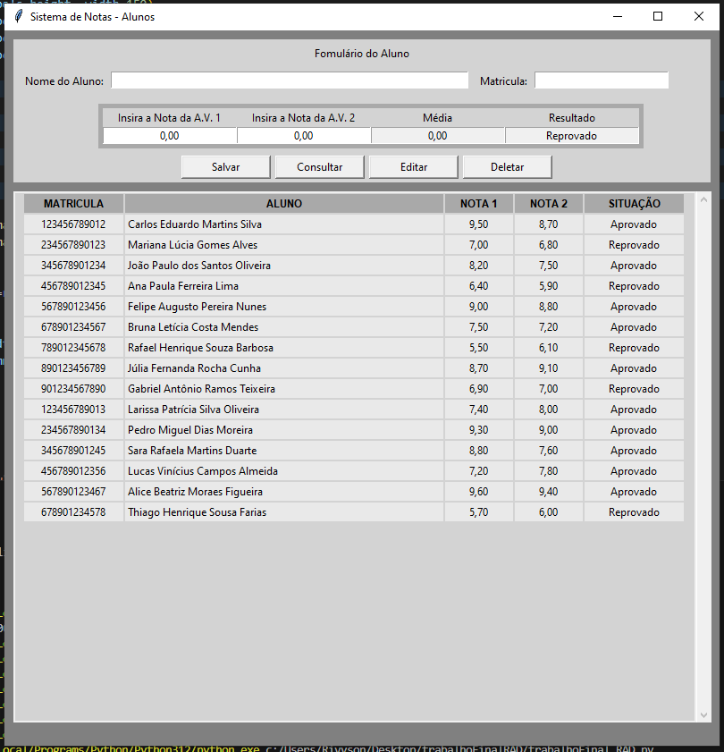
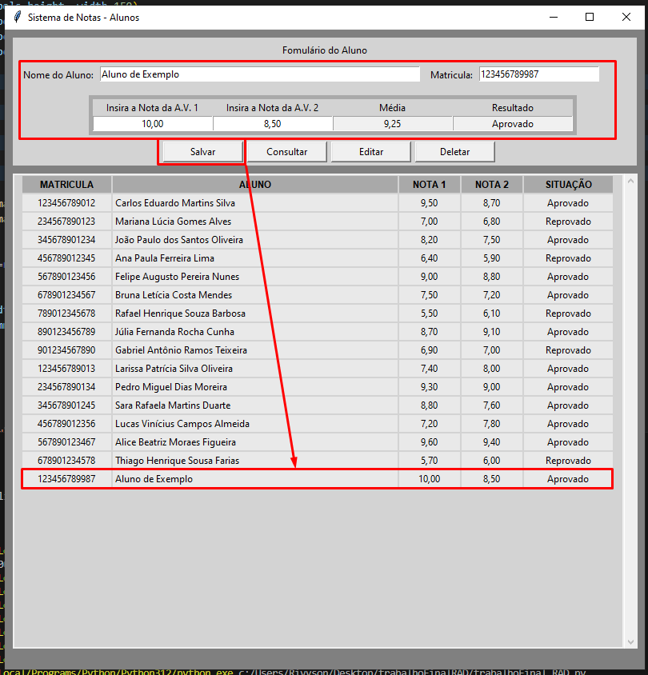
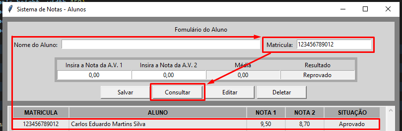
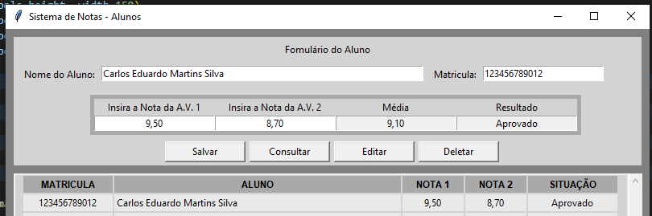
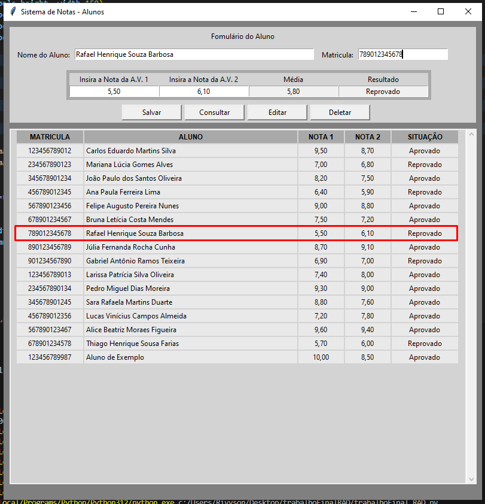
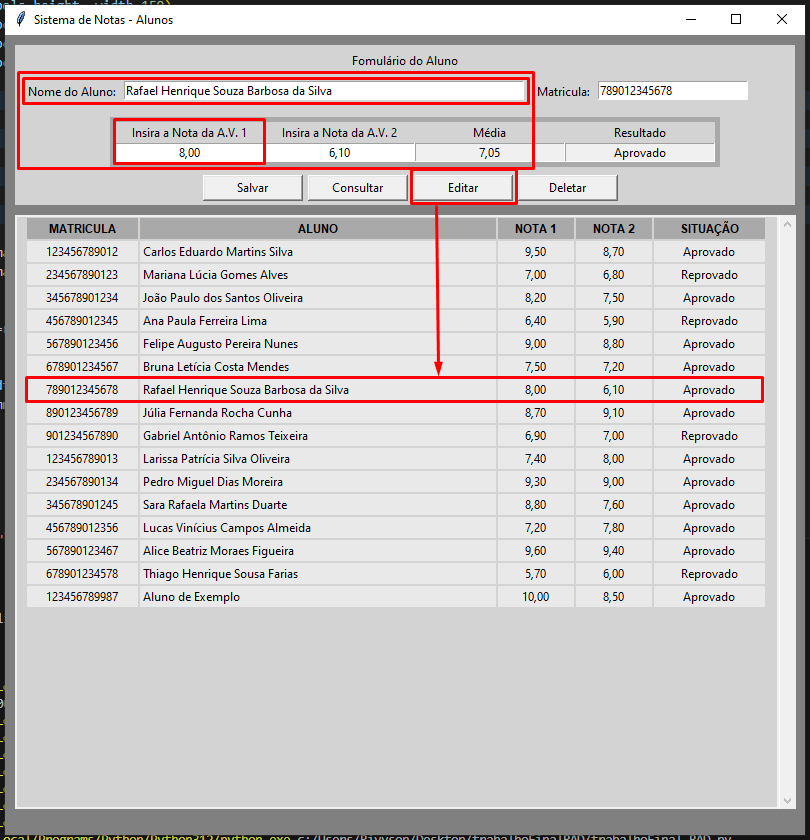
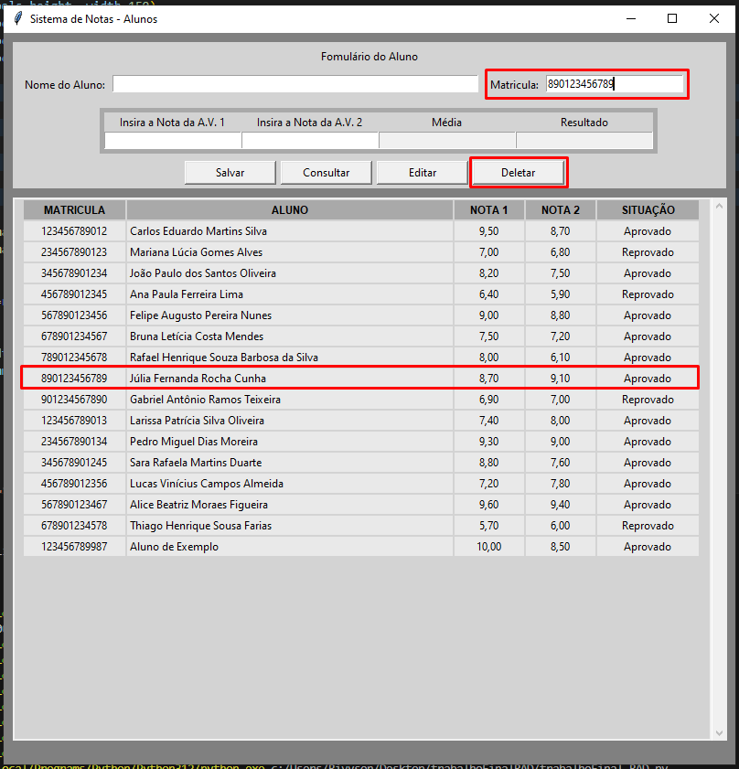
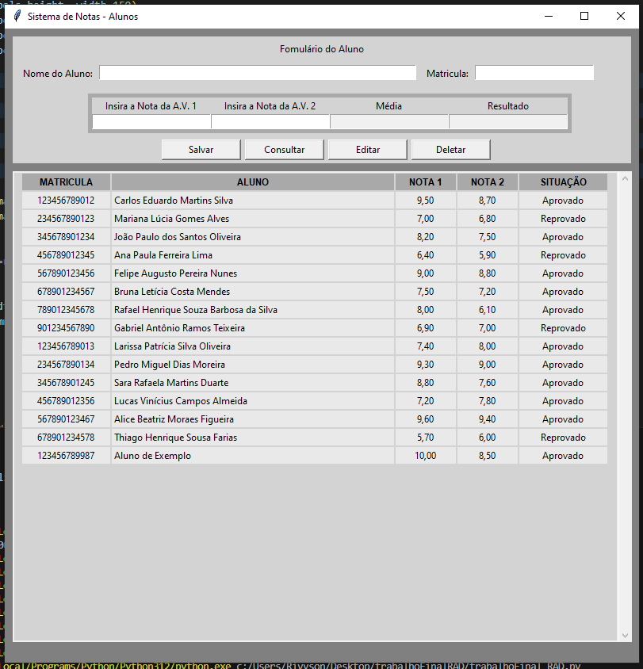

# SISTEMA DE NOTA DE ALUNOS - TRABALHO FINAL

O sistema consiste em um CRUD feito usando o TKINTER para U.I. e o SQLite3 pra salvar os dados

##### PASSAREMOS POR CADA ETAPA DP CRUD

## CREATE (CRIAR)

## READ (LEITURA / CONSULTA)

 

## UPDATE (ATUALIZAR / EDITAR)

 

## DELETE (APAGAR)

 